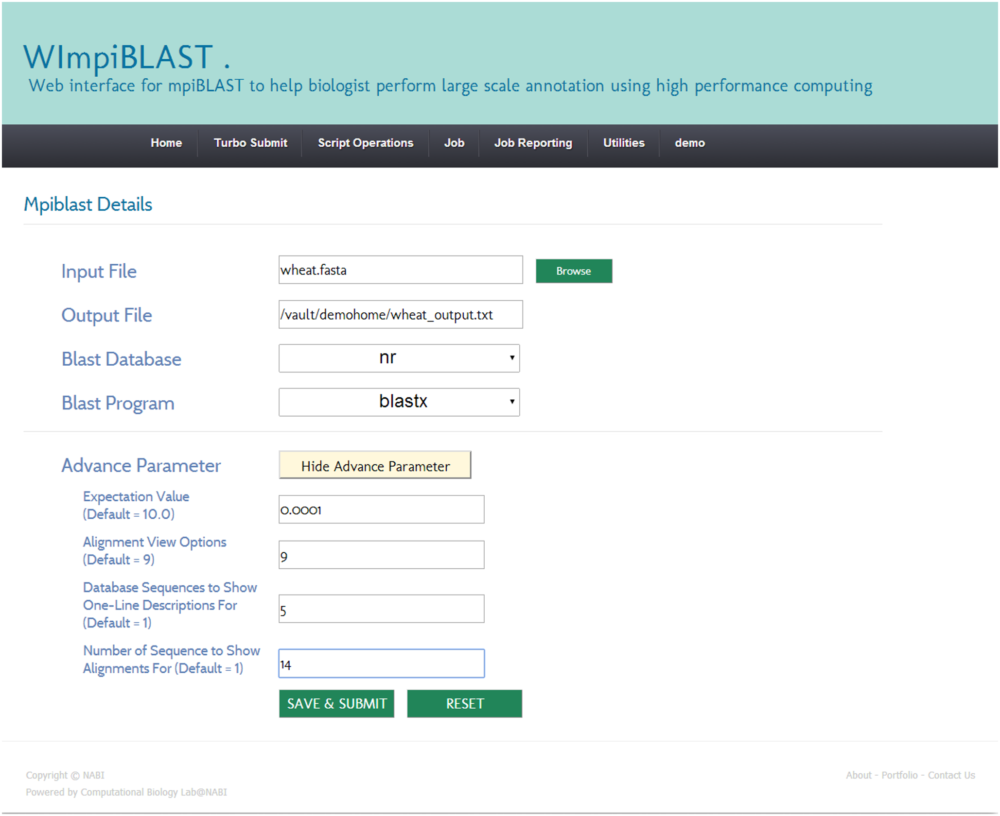
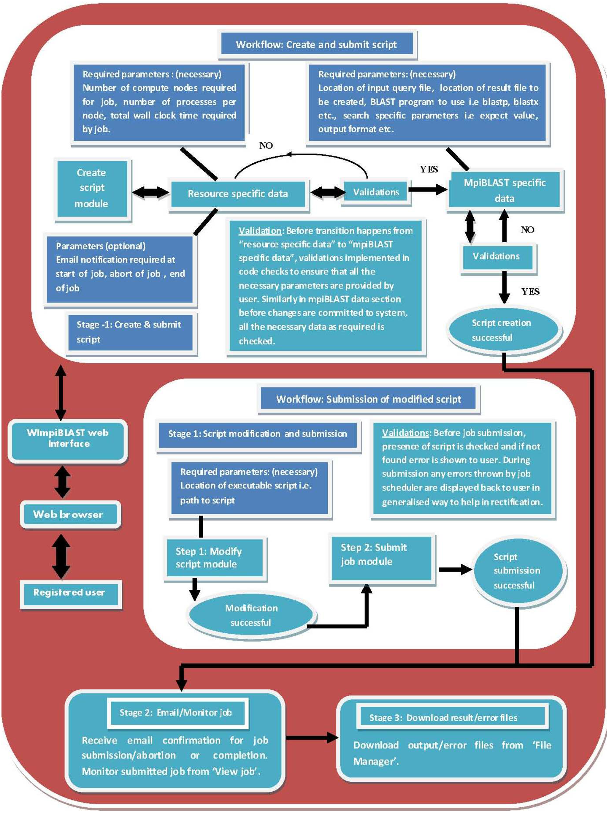

## WImpiBLAST: Breaking Down Computational Barriers for Biologists

### Bringing High Performance Computing to L ife Sciences

WImpiBLAST is a user-friendly web interface that helps biologists perform large-scale annotation using high performance computing (HPC). Developed by researchers Parichit Sharma and Shrikant S. Mantri, this open-source tool bridges the gap between powerful parallel computing resources and biologists who may lack extensive programming experience. The interface makes it possible to harness the speed of mpiBLAST (a parallelized version of the popular BLAST sequence analysis tool) without needing expertise in Linux command line or HPC cluster operations.

### Accelerating Genomic Research Through Computational Power

This work addresses a critical bottleneck in modern genomics research. With next-generation sequencing technologies generating massive amounts of data, traditional sequence similarity searches can take days to complete on standard computers. The function of a newly sequenced gene can be discovered by determining its sequence homology with known proteins. BLAST is the most extensively used sequence analysis program for sequence similarity search in large databases of sequences.

WImpiBLAST dramatically reduces this analysis time by making HPC resources accessible to biologists. The use cases presented in the paper demonstrate remarkable performance improvements - in some instances achieving up to 1,000 times faster results compared to standard BLAST searches. 

  
   

__Figure 1:__  A representative snapshot of the mpiBLAST specific module creation.

### Three-Tier Architecture: A Framework for Scientific Tool Accessibility

The most innovative aspect of WImpiBLAST is its carefully designed three-tier architecture that elegantly separates user interface, system components, and computational resources. To establish a separation between the different components (the web interface component, system software components and computational resources components), a conceptual three-tiered architecture for WImpiBLAST was adopted. This architectural approach ensures that:

 - Biologists only need to interact with the user-friendly web layer
 - System administrators can maintain and update the underlying software without disrupting the user experience
 - Computational resources are efficiently utilized through proper job management

  
   

__Figure 2:__ Procedural workflow in WImpiBLAST showing the initiation of mpiBLAST job, the input required at each stage and validations between stages to prevent invalid data from entering into successive stages.

### Benchmark Highlights

Number of sequences searched| blastX (NCBI) execution time | mpiBLAST (WImpiBLAST) execution time
--- | --- | ---
 43,758 | 96.96 hours | 4.21 hours

The readings show that on the same number of cores i.e. 48, mpiBLAST outperforms NCBI BLAST+ by roughly 1.76 times. The maximum speedup was observed when using all 448 cores on the HPC cluster where mpiBLAST is 23.03 times faster than NCBI BLAST+. (Number of sequences in fasta file = 43758; Type: Nucleotide; No. of aligned Sequences = 1.

#### Related Work

Check out [Paper](https://journals.plos.org/plosone/article?id=10.1371/journal.pone.0101144)

#### Contact Details

For help with compiling/running, or reporting issues-please let us know at __parishar__[at]__iu__[dot]__edu__. We would be happy to help you out.

